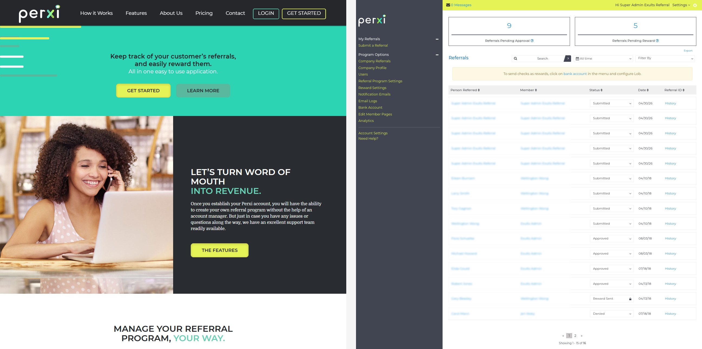

# 🚀 Laravel Projects Collection

A collection of web applications built using Laravel, showcasing
different real-world systems such as business management and e-commerce
solutions.

------------------------------------------------------------------------

## 📌 Overview

This repository contains multiple projects developed with Laravel, a PHP
framework known for its elegant syntax and powerful tools for building
modern web applications.

Each project demonstrates practical use cases, including business
websites and inventory systems.

------------------------------------------------------------------------

## 📌 Project Description

A modern web application designed to help businesses manage customer referral programs efficiently. It provides an all-in-one platform to track referrals, reward customers, and turn word-of-mouth into measurable revenue.

The platform focuses on simplicity and usability, allowing businesses to easily create, manage, and optimize referral campaigns without relying on manual processes like forms or spreadsheets.

With a clean, responsive interface and clear user flows, it enables companies to streamline their referral systems while improving customer engagement and retention.

### 💡 Key Highlights

- Centralized referral management system  
- Easy tracking of customer referrals and rewards  
- User-friendly interface for both businesses and customers  
- Customizable referral workflows  
- Designed for multiple industries (e.g., medical, automotive, marketing)  
- Optimized for performance and responsiveness  
- Built to convert referrals into real business growth  

### 🎯 Goal

The goal of this project is to simplify referral marketing by providing a scalable, easy-to-use solution that helps businesses grow through trusted customer recommendations.

------------------------------------------------------------------------

## 🛠️ Tech Stack

-   Framework: Laravel\
-   Language: PHP\
-   Database: MySQL (or compatible)\
-   Tools: Composer, Artisan CLI
-	Git & GitHub (Version Control)  

------------------------------------------------------------------------

## 📸 Preview



---

## ⚙️ Installation & Setup

### Requirements

-   PHP installed\
-   Composer installed\
-   A local server (XAMPP, Laragon, etc.)\
-   A database ready
-	Code editor (VS Code, PHPStorm, etc.) 

### Steps

``` bash
git clone https://github.com/wellington-wong/laravel.git
cd laravel
```

Install dependencies:

``` bash
composer install
```

Set up environment:

``` bash
cp .env.example .env
php artisan key:generate
```

Run database migrations:

``` bash
php artisan migrate
```

Start the development server:

``` bash
php artisan serve
```

------------------------------------------------------------------------

## ▶️ Usage

-   Access the app via `http://127.0.0.1:8000`\
-   Navigate through each project/module\
-   Configure `.env` for database and environment settings

------------------------------------------------------------------------

## 🎯 Purpose

This project is intended to:

-   Showcase Laravel-based web applications\
-   Demonstrate real-world business system development\
-   Practice backend architecture and database design\
-   Explore CRUD operations and system workflows\
-   Build scalable and maintainable web applications\
-   Strengthen full-stack development skills\
-   Serve as a portfolio of Laravel projects

------------------------------------------------------------------------

## 📄 License

This project is open-source and available under the MIT License.

------------------------------------------------------------------------

## 👤 Author

Wellington Wong\
https://github.com/wellington-wong

------------------------------------------------------------------------

## ⭐ Support

If you find this project useful, give it a star on GitHub!
